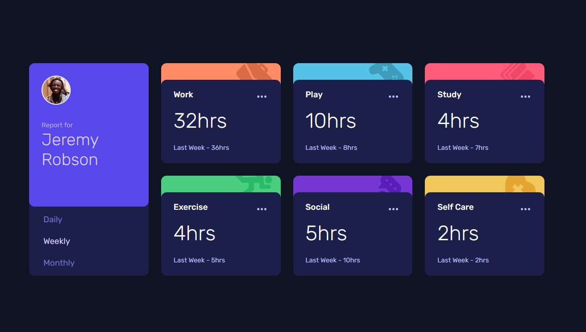
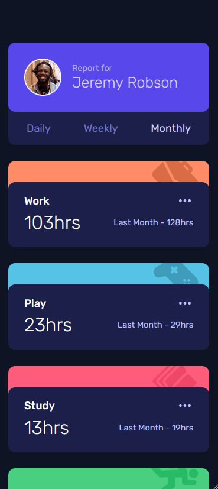

# Frontend Mentor - Time tracking dashboard solution

This is a solution to the [Time tracking dashboard challenge on Frontend Mentor](https://www.frontendmentor.io/challenges/time-tracking-dashboard-UIQ7167Jw). Frontend Mentor challenges help you improve your coding skills by building realistic projects.

## Table of contents

- [Overview](#overview)
  - [The challenge](#the-challenge)
  - [Screenshot](#screenshot)
  - [Links](#links)
- [My process](#my-process)
  - [Built with](#built-with)
  - [What I learned](#what-i-learned)
  - [Continued development](#continued-development)
  - [Useful resources](#useful-resources)
- [Author](#author)

## Overview

### The challenge

Users should be able to:

- View the optimal layout for the site depending on their device's screen size
- See hover states for all interactive elements on the page
- Switch between viewing Daily, Weekly, and Monthly stats

### Screenshot

### Links

- Solution URL: [https://github.com/Robert-Rynard/time-tracking-dashboard-react](https://github.com/Robert-Rynard/time-tracking-dashboard-react)
- Live Site URL: [https://robert-rynard.github.io/time-tracking-dashboard-react/](https://robert-rynard.github.io/time-tracking-dashboard-react/)

## My process

### Built with

- CSS custom properties
- CSS Grid
- Mobile-first workflow
- [React](https://reactjs.org/) - JS library
- Fetch API

### What I learned

In this challenge I was able to use the Fetch API with the provided data.json file to populate data based on the selected time period. This provided good practice for how to handle APIs in React and how to implement the useEffect hook to handle the Fetch API.

### Continued development

This was my first time using the Fetch API and going forward I would like to learn more about the different ways of handling API such as using the Axios library and implementing Async Await to the code as an alternative to the `.then()` syntax

### Useful resources

- [Fetching Data in React](https://www.freecodecamp.org/news/fetch-data-react/) - This article explained a few of the different ways you can implement data fetching in React.

## Author

- Website - [Robert Rynard](https://github.com/Robert-Rynard)
- Frontend Mentor - [@Robert-Rynard](https://www.frontendmentor.io/profile/Robert-Rynard)
- Twitter - [@robert_rynard](https://www.twitter.com/robert_rynard)
